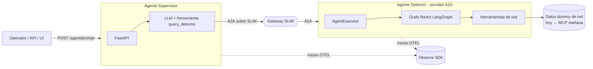
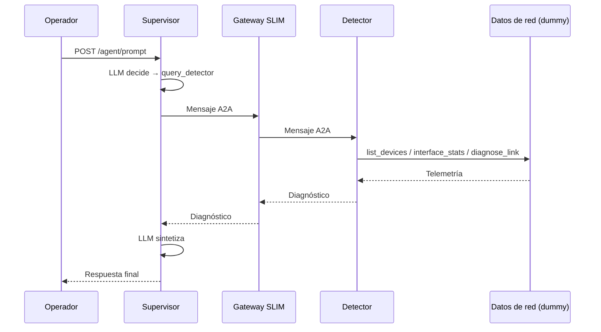

# Packet Panic — NOC con dos agentes sobre AGNTCY

Sistema de **dos agentes** para un NOC (Network Operations Center), construido
sobre el ecosistema [AGNTCY](https://docs.agntcy.org/) (Internet of Agents) y
siguiendo el patrón de referencia **Corto** de
[CoffeeAGNTCY](https://github.com/agntcy/coffeeAgntcy).

- **Agente Supervisor**: el cerebro del NOC. Atiende al operador, razona y
  **delega** en el detector cuando necesita datos de la red. No toca los
  dispositivos.
- **Agente Detector**: tiene el **acceso a la red**. Hoy responde con **datos
  *dummy*** deterministas; mañana se conectará a un **servidor MCP** sin cambiar
  el grafo del agente.

Los dos agentes se comunican mediante **A2A** (Agent-to-Agent) sobre el
transporte **SLIM** de AGNTCY.

---

## Diseño

| Componente AGNTCY | En este proyecto | Rol |
|---|---|---|
| App SDK (`AgntcyFactory`) | Ambos agentes | Construye clientes/servidores A2A agnósticos al transporte. |
| SLIM | `slim` (contenedor) | Bus de mensajería seguro entre agentes. |
| A2A + `AgentCard` | `detector/card.py` | Manifiesto de capacidades del detector. |
| LangGraph | `detector/agent.py`, `supervisor/agent.py` | Orquestación dentro de cada agente. |
| Observe SDK | decoradores `@agent`, `@graph` | Trazabilidad de extremo a extremo. |
| MCP *(futuro)* | `detector/tools/` | Capa de acceso a dispositivos (hoy *dummy*). |

### Arquitectura



### Flujo de trabajo

1. El operador envía una consulta a `POST /agent/prompt` del **Supervisor**.
2. El LLM del supervisor decide si necesita datos de la red. Si sí, llama a su
   herramienta `query_detector` con una instrucción específica.
3. La herramienta envía un mensaje **A2A** al **Detector** a través del **gateway
   SLIM**.
4. El **Detector** (agente ReAct) elige las herramientas de red adecuadas
   (`list_devices`, `device_health`, `interface_stats`, `link_diagnostics`),
   consulta los **datos dummy** y redacta un diagnóstico.
5. El diagnóstico regresa por A2A al supervisor, que **sintetiza** la respuesta
   final para el operador.



---

## Estructura del proyecto

```
packet-panic-agntcy/
├── docker-compose.yaml          # Gateway SLIM + detector + supervisor
├── pyproject.toml               # Dependencias del proyecto
├── .env.example                 # Plantilla de variables de entorno
│
├── config/
│   ├── config.py                # Endpoints, transporte, modelo LLM, timeouts
│   └── logging_config.py        # Configuración de logs
├── common/
│   └── llm.py                   # Cliente LLM vía LiteLLM
│
├── oasf/
│   └── agents/                  # Registros OASF (manifiestos para el Agent Directory)
│       ├── noc-detector-agent.json
│       └── noc-supervisor-agent.json
│
├── supervisor/                  # ← Agente Supervisor (cliente A2A)
│   ├── main.py                  # API FastAPI: /agent/prompt
│   ├── agent.py                 # LangGraph + herramienta query_detector
│   └── errors.py                # Manejo de timeouts / sin respuesta
│
└── detector/                    # ← Agente Detector (servidor A2A)
    ├── detector_server.py       # Arranque del transporte SLIM + A2A
    ├── agent.py                 # Grafo ReAct del detector
    ├── agent_executor.py        # Adaptador A2A → grafo
    ├── card.py                  # AgentCard (capacidades)
    └── tools/
        ├── dummy_network.py     # Datos dummy (se reemplaza por MCP)
        └── langchain_tools.py   # Herramientas LangChain del detector
```

---

## Primeros pasos

### Requisitos

- Python **3.12+**
- Una llave de API para un proveedor de LLM (OpenAI, Azure, Groq, etc.)
- Para la opción con contenedores: **Docker** y **Docker Compose**

### 1. Configurar variables de entorno

```sh
cp .env.example .env
```

Edita `.env` y define al menos tu modelo y credenciales:

```env
LLM_MODEL="openai/gpt-4o-mini"
OPENAI_API_KEY=tu_llave_aqui
```

> El proyecto usa **LiteLLM**, así que puedes apuntar a cualquier proveedor
> compatible cambiando `LLM_MODEL` (por ejemplo `azure/<deployment>` o
> `groq/<modelo>`).

### Opción A — Docker Compose (recomendada)

Levanta el gateway SLIM y los dos agentes:

```sh
docker compose up --build
```

El supervisor queda disponible en `http://localhost:8000`.

### Opción B — Python local

Cada componente corre en su propia terminal. El transporte por defecto es SLIM,
así que primero necesitas el gateway (vía Docker):

```sh
# Terminal 1: gateway SLIM
docker compose up slim
```

```sh
# Instala dependencias (recomendado con uv o venv)
python -m venv .venv && source .venv/bin/activate
pip install -e .
```

```sh
# Terminal 2: Agente Detector
python -m detector.detector_server
```

```sh
# Terminal 3: Agente Supervisor (API)
python -m supervisor.main
```

> ¿No quieres levantar SLIM? Pon `DEFAULT_MESSAGE_TRANSPORT=A2A` en `.env` para
> que el detector sirva por HTTP nativo (sin gateway). Útil para pruebas rápidas.

### 2. Probar el sistema

```sh
curl -X POST http://localhost:8000/agent/prompt \
  -H "Content-Type: application/json" \
  -d '{"prompt": "¿Hay pérdida de paquetes en TenGigE0/0/0/0 de core-rtr-01?"}'
```

Otros ejemplos:

```sh
curl -X POST http://localhost:8000/agent/prompt \
  -H "Content-Type: application/json" \
  -d '{"prompt": "Dame la salud de core-rtr-02"}'

curl -X POST http://localhost:8000/agent/prompt \
  -H "Content-Type: application/json" \
  -d '{"prompt": "Lista los dispositivos del sitio DC-2"}'
```

Endpoints útiles del supervisor:

- `POST /agent/prompt` — envía una consulta al NOC.
- `GET /health` — estado del supervisor.
- `GET /suggested-prompts` — ejemplos de consultas.

---

## Datos *dummy* de la red

El inventario simulado vive en
[`detector/tools/dummy_network.py`](detector/tools/dummy_network.py). Incluye
cuatro dispositivos de ejemplo (`core-rtr-01`, `core-rtr-02`, `dist-sw-01`,
`edge-fw-01`) en dos sitios (`DC-1`, `DC-2`). Los valores son **deterministas**:
la misma consulta devuelve siempre el mismo resultado, ideal para demos.

### Migrar a MCP más adelante

Cuando conectes tu servidor MCP, **solo** reemplaza el cuerpo de las funciones de
`dummy_network.py` (`get_device_inventory`, `get_device_health`,
`get_interface_stats`, `diagnose_link`) por llamadas al cliente MCP. Mantén las
firmas y **ni el grafo del detector ni el supervisor necesitarán cambios**.

---

## Registros OASF (Agent Directory)

El `AgentCard` de A2A (en `detector/card.py`) es el **manifiesto en tiempo de
ejecución** que usan los agentes para el *handshake* A2A. Es la misma práctica que
sigue **CoffeeAGNTCY** (su `corto/farm/card.py`).

Además, AGNTCY define **OASF** (Open Agentic Schema Framework) como el esquema
*canónico* para el Internet of Agents. Corto mantiene registros OASF estáticos en
`oasf/agents/*.json`; aquí replicamos ese patrón:

```
oasf/agents/
├── noc-detector-agent.json      # Registro OASF del detector
└── noc-supervisor-agent.json    # Registro OASF del supervisor
```

Cada registro incluye el bloque `modules → integration/a2a` con el `card_data`
derivado del `AgentCard` correspondiente, de modo que el `AgentCard` de A2A y el
registro OASF describen las mismas capacidades.

| Artefacto | Formato | Propósito |
|-----------|---------|-----------|
| `AgentCard` | Python (`a2a.types.AgentCard`) | Manifiesto A2A en tiempo de ejecución |
| Registro OASF | JSON (esquema OASF `0.8.0`) | Publicación y descubrimiento vía **Agent Directory** |

> **Nota sobre la taxonomía:** los campos `domains[].id` y `skills[].id` usan la
> taxonomía OASF. Los valores aquí son representativos; valídalos/ajústalos contra
> el esquema oficial de OASF antes de publicar en un directorio real.

Más adelante, estos registros se publican en un **Agent Directory** de AGNTCY
(*push / pull / search*) mediante el App SDK, que realiza la conversión
`OASF ↔ AgentCard` automáticamente. El flujo típico es:

```
registro OASF (json)  →  dirctl / App SDK push  →  Agent Directory  →  otros agentes lo descubren (search/pull)
```

---

## Seguridad y siguientes pasos

- **Frontera de acceso**: solo el detector toca la red. El supervisor razona y
  delega. Más adelante puedes reforzar esto con el **Identity Service + TBAC** de
  AGNTCY para autorizar qué agente puede invocar las herramientas de dispositivo.
- **Escalar a varios detectores** (por región o por fabricante): el patrón
  *publisher/subscriber* y *group communication* de **Lungo** (el hermano mayor de
  Corto en CoffeeAGNTCY) muestra cómo difundir a múltiples agentes.
- **Observabilidad**: activa el **Observe SDK** (`OTEL_SDK_DISABLED=false`) y un
  colector OTEL para ver las trazas de cada salto agente→herramienta.

---

## Licencia

Apache-2.0.
