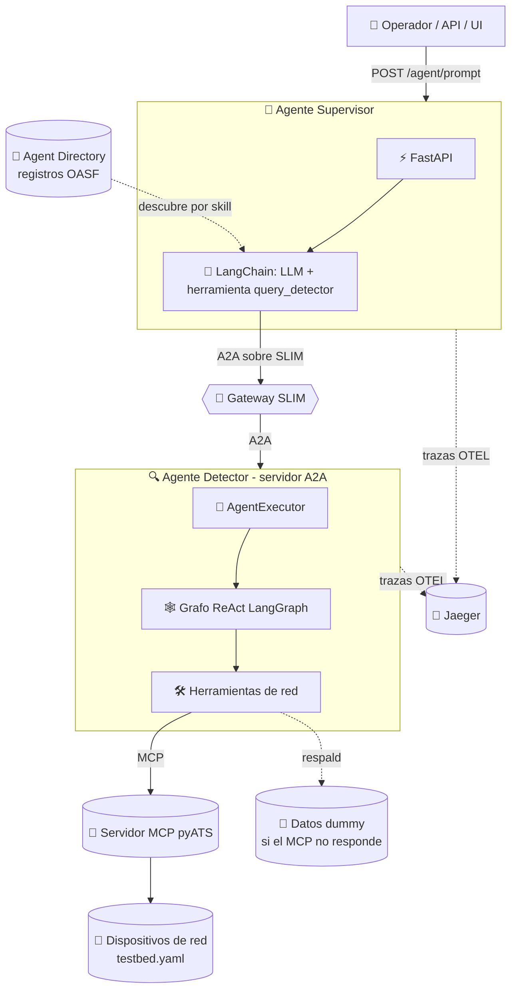
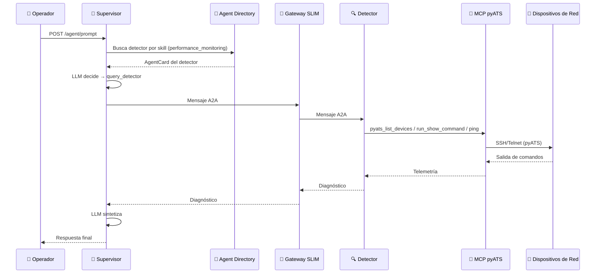
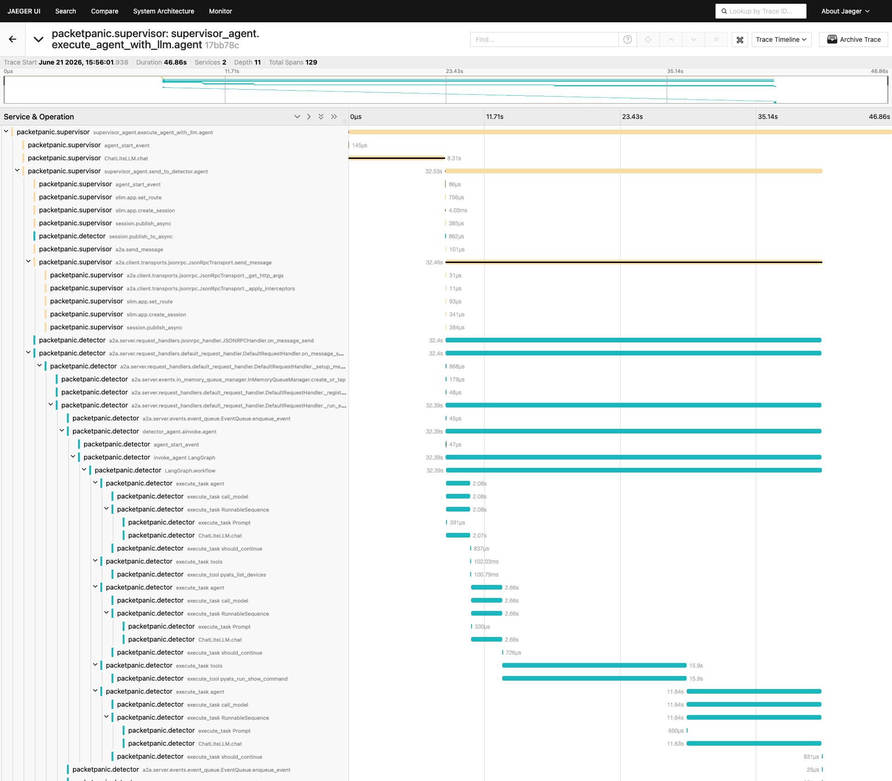
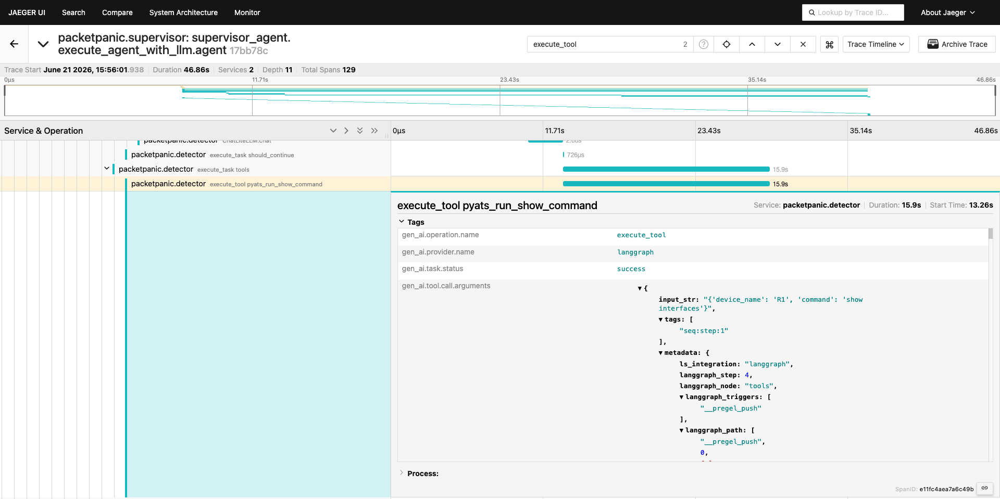

# Packet Panic 📦🔥 AGNTCY
## Caso de Uso de un MAS (Multi-Agent System) construido sobre el ecosistema [AGNTCY](https://docs.agntcy.org/)

<div align="center">


</div>

---
> 🗃️ Consulta aquí [las diapositivas presentadas durante la OpenSouthCode 2026](De%20la%20Torre%20de%20Babel%20al%20Internet%20de%20Agentes%20-%20el%20proyecto%20open-source%20AGNTCY.pdf)
---

## Índice

- [En pocas palabras](#en-pocas-palabras)
- [Diseño](#diseño)
  - [Arquitectura](#arquitectura)
  - [Cómo funciona](#cómo-funciona)
- [Estructura del proyecto](#estructura-del-proyecto)
- [Primeros pasos](#primeros-pasos)
  - [Requisitos](#requisitos)
  - [1. Configurar variables de entorno](#1-configurar-variables-de-entorno)
  - [2. El testbed de pyATS](#2-el-testbed-de-pyats)
  - [3. Servicios con Docker Compose](#3-servicios-con-docker-compose)
  - [4. Probar el sistema](#4-probar-el-sistema)
- [Explorando las trazas en Jaeger](#explorando-las-trazas-en-jaeger)
- [Apéndice](#apéndice)
  - [Acceso a la red: pyATS vía MCP](#acceso-a-la-red-pyats-vía-mcp)
  - [Registros OASF (Agent Directory)](#registros-oasf-agent-directory)
- [Contribuciones](#-contribuciones)

---

## En pocas palabras

**Packet Panic** es un sistema de dos agentes de IA que ayudan a consultar y diagnosticar una red de datos,
tal y como lo haría un equipo de NOC (Network Operations Center). Tú escribes una
pregunta en lenguaje natural, por ejemplo `"¿hay errores en las interfaces de
R1?"` y los agentes se encargan del resto:

- 🧠 Un **Supervisor** recibe tu consulta, razona qué hace falta y delega.
- 🔍 Un **Detector** se conecta a los dispositivos de red reales (vía pyATS con un servidor MCP), corre
  los comandos adecuados y regresa un diagnóstico.

Ambos agentes platican entre sí usando las piezas del ecosistema **AGNTCY** (A2A,
SLIM, Agent Directory, MCP y observabilidad con Jaeger). Si no tienes acceso a una
red de verdad, el sistema usa datos *dummy* para que puedas probarlo sin
complicaciones. En resumen: **le preguntas a tu red en español y un par de agentes
te contestan con el diagnóstico.**

---

## Diseño

| Componente AGNTCY | En este proyecto | Rol |
|---|---|---|
| 🏗️ App SDK (`AgntcyFactory`) | Ambos agentes | Construye clientes/servidores A2A agnósticos al transporte |
| 🚌 SLIM | `slim` (contenedor) | Bus de mensajería seguro entre agentes |
| 🤝 A2A + `AgentCard` | `agents/detector/card.py` | Manifiesto de capacidades del detector |
| 📒 Agent Directory (OASF) | `common/directory.py`, `oasf/agents/` | Descubrimiento dinámico del detector por capacidad |
| 🕸️ LangGraph | `agents/detector/agent.py` | Grafo ReAct del **Detector** (`create_react_agent`) |
| 🦜 LangChain (tool-calling) | `agents/supervisor/agent.py` | Orquestación del **Supervisor** (LLM con `bind_tools`, sin grafo) |
| 🔭 Observe SDK + Jaeger | decoradores `@agent`, `@graph`; servicio `jaeger` | Trazabilidad OpenTelemetry de extremo a extremo |
| 🔌 MCP (pyATS) | `agents/detector/tools/mcp_client.py`, `pyats-mcp` (contenedor) | Acceso a dispositivos de red reales (Cisco/pyATS) |

### Arquitectura



### Cómo funciona

1. El operador envía una consulta a `POST /agent/prompt` del **Supervisor**.
2. El supervisor **descubre** al detector en el **Agent Directory** por su
   capacidad OASF (`performance_monitoring`) y abre la sesión A2A hacia él.
3. El LLM del supervisor decide si necesita datos de la red. Si sí, llama a su
   herramienta `query_detector` con una instrucción específica.
4. La herramienta envía un mensaje **A2A** al **Detector** a través del **gateway
   SLIM**.
5. El **Detector** (agente ReAct) elige las herramientas de pyATS adecuadas
   (`pyats_list_devices`, `pyats_run_show_command`,
   `pyats_ping_from_network_device`, `pyats_show_logging`), consulta los
   **dispositivos reales** vía el **servidor MCP de pyATS** y redacta un
   diagnóstico. Si el MCP no está disponible, usa las herramientas dummy.
6. El diagnóstico regresa por A2A al supervisor, que **sintetiza** la respuesta
   final para el operador.

   </br></br>



---

## Estructura del proyecto

```
packet-panic-agntcy/
├── docker-compose.yaml          # Contenedored de SLIM + detector + supervisor + pyATS MCP + Jaeger
├── pyproject.toml               # Dependencias del proyecto
├── testbed.yaml                 # Inventario pyATS (dispositivos de red reales)
├── .env.example                 # Plantilla de variables de entorno
│
├── docker/
│   ├── Dockerfile               # Imagen común de los agentes
│   ├── entrypoint.sh            # Arranque (carga de CAs corporativas, etc.)
│   ├── slim-config.yaml         # Configuración del gateway SLIM
│   └── certs/                   # CAs corporativas montadas (no horneadas)
│
├── config/
│   ├── config.py                # Endpoints, transporte, MCP, LLM, OTEL, timeouts
│   └── logging_config.py        # Configuración de logs
├── common/
│   ├── llm.py                   # Cliente LLM vía LiteLLM
│   └── directory.py             # Descubrimiento de agentes por capacidad OASF
│
├── oasf/
│   └── agents/                  # Registros OASF (manifiestos para el Agent Directory)
│       ├── noc-detector-agent.json
│       └── noc-supervisor-agent.json
│
├── scripts/
│   └── directory_demo.sh        # Demo: publica y descubre agentes por capacidad
│
└── agents/                      # ← Los dos agentes del NOC
    ├── supervisor/              # ← Agente Supervisor (cliente A2A)
    │   ├── main.py              # API FastAPI: /agent/prompt
    │   ├── agent.py             # LangChain (LLM + bind_tools) + query_detector + descubrimiento
    │   └── errors.py            # Manejo de timeouts / sin respuesta
    │
    └── detector/               # ← Agente Detector (servidor A2A)
        ├── detector_server.py  # Arranque del transporte SLIM + A2A
        ├── agent.py            # Grafo ReAct del detector
        ├── agent_executor.py   # Adaptador A2A → grafo
        ├── card.py             # AgentCard (capacidades)
        └── tools/
            ├── mcp_client.py      # Cliente del servidor MCP de pyATS
            ├── langchain_tools.py # Herramientas del detector (MCP con respaldo dummy)
            └── dummy_network.py   # Datos dummy de respaldo
```

---

## Primeros pasos

### Requisitos

- Python **3.12+**
- Una llave de API para un proveedor de LLM (OpenAI, Azure, Groq, etc.)
- **Docker** y **Docker Compose**
- **Para consultar dispositivos reales:** testbed alcanzable (por defecto, usaremos [el sandbox de Cisco CML](https://devnetsandbox.cisco.com/DevNet/catalog/cml-sandbox_cml)). Sin él, el agente detector usa datos dummy.

### 1. Configurar variables de entorno

```sh
cp .env.example .env
```

Edita `.env` y define al menos tu modelo y credenciales:

```env
LLM_MODEL="openai/gpt-4o-mini"
OPENAI_API_KEY=tu_llave_aqui
```

> El proyecto usa **LiteLLM**, así que puedes usar cualquier proveedor
> compatible cambiando `LLM_MODEL` (por ejemplo `azure/<deployment>` o
> `groq/<modelo>`). Consulta la lista completa de prefijos de modelo y variables
> de API key en la [documentación de proveedores de LiteLLM](https://docs.litellm.ai/docs/providers).

Variables relevantes adicionales (todas con valores por defecto):

```env
# Servidor MCP de pyATS (consultas reales a la red)
PYATS_MCP_ENABLED=true            # ponlo en false para usar solo datos dummy
PYATS_MCP_PORT=8082
PYATS_MCP_URL=http://pyats-mcp:8082/mcp

# Observabilidad (trazas OTEL → Jaeger)
OTEL_SDK_DISABLED=true            # ponlo en false para exportar trazas a Jaeger
OTLP_HTTP_ENDPOINT=http://localhost:4318
```

### 2. El testbed de pyATS

El detector consulta dispositivos reales descritos en
[`testbed.yaml`](testbed.yaml). Por defecto apunta a los routers y switches del
**Cisco Modeling Labs — Always-On Sandbox** (`R1`, `R2`, `SW1`, `SW2`, IOS-XE),
que puedes reservar gratis en
[DevNet Sandbox](https://devnetsandbox.cisco.com/DevNet/catalog/cml-sandbox_cml).
Necesitas el cliente VPN del sandbox activo para alcanzar esos dispositivos.
Puedes sustituir `testbed.yaml` por tu propio inventario manteniendo la misma
estructura.

### 3. Servicios con Docker Compose

Levanta el gateway SLIM, los dos agentes, el servidor MCP de pyATS y Jaeger:

```sh
docker compose up --build
```

**¡Listo!** Tus agentes y recursos están funcionando. Para validar, puedes enlistar tus contenedores activos. Deberías encontrar los soguientes:

```bash
docker ps | grep packetpanic
```

```bash
4fdd65981ba7   packet-panic-agntcy-supervisor   "/usr/local/bin/entr…"   54 seconds ago   Up 54 seconds   0.0.0.0:8000->8000/tcp    packetpanic-supervisor
c4db18172507   packet-panic-agntcy-detector     "/usr/local/bin/entr…"   55 seconds ago   Up 54 seconds    packetpanic-detector
e707574b2a96   jaegertracing/all-in-one:1.60    "/go/bin/all-in-one-…"   55 seconds ago   Up 54 seconds   5775/udp, 5778/tcp, 9411/tcp, 14250/tcp, 0.0.0.0:4317-4318->4317-4318/tcp, 0.0.0.0:16686->16686/tcp, 6831-6832/udp, 14268/tcp   packetpanic-jaeger
bb2dcab2c147   ghcr.io/agntcy/slim:1.4.0        "/slim --config /con…"   55 seconds ago   Up 54 seconds   0.0.0.0:46357->46357/tcp    packetpanic-slim
70dd317d6f1b   ghcr.io/agntcy/dir-ctl:v1.5.0    "./dirctl daemon sta…"   55 seconds ago   Up 54 seconds    packetpanic-directory
```

Puedes usar las siguientes URLs para interactuar con tus agentes:

| Servicio | URL | Descripción |
|----------|-----|-------------|
| 🧠 Supervisor (API) | `http://localhost:8000` | Endpoint principal del agente supervisor. |
| 📜 Especificación OpenAPI | `http://localhost:8000/docs` | UI para probar los endpoints desde la WebUI. |
| 🔭 Trazas de Jaeger | `http://localhost:16686` | UI de observabilidad y trazas OTEL. |


### 4. Probar el sistema

Es posible utilizar herramientas como `cURL` directamente en tu CLI, o bien otros clientes REST como Postman. Incluso, en la URL http://localhost:8000/docs se encuentra disponible la especificación OpenAPI del sistema, siendo posible mandar peticiones usando la Web UI.

En este caso, usaremos peticiones vía `cURL` directamente en nuestra consola:

```sh
curl -X POST http://localhost:8000/agent/prompt \
  -H "Content-Type: application/json" \
  -d '{"prompt": "¿Hay errores o descartes en las interfaces de R1?"}'
```

La API responde con un objeto JSON que contiene el diagnóstico en texto plano
(campo `response`) y el identificador de la sesión (`session_id`):

```json
{
  "response": "Resultado del análisis de R1\n\nEstado general: SALUDABLE\n\nNo se detectan errores ni descartes en ninguna interfaz de R1.\n\nInterfaces:\n1. Eth0/0  up/up        10.10.10.100/24   Errores IN: 0  Errores OUT: 0  Drops: 0\n2. Eth0/1  up/up         1.1.1.1/24       Errores IN: 0  Errores OUT: 0  Drops: 0\n3. Eth0/2  up/up        10.10.20.171/24   Errores IN: 0  Errores OUT: 0  Drops: 0\n4. Eth0/3  admin down   --                Errores IN: 0  Errores OUT: 0  Drops: 0\n\nObservaciones:\n- Los contadores nunca han sido limpiados.\n- Eth0/3 esta apagada administrativamente (shutdown).\n- Sin indicios de problemas de capa fisica (CRC, runts, giants) ni congestion (drops de cola).\n\nAccion requerida: Ninguna. Si necesitas monitoreo continuo o limpiar contadores (clear counters), indicamelo.",
  "session_id": "packetpanic.supervisor_3c20759d-7403-496c-b10f-7d914f4342a9"
}
```

Con un poco de Python, se puede imprimir el resultado de la siguiente manera:

```bash
curl -s -X POST http://localhost:8000/agent/prompt \
  -H "Content-Type: application/json" \
  -d '{"prompt": "¿Hay errores o descartes en las interfaces de R1?"}' \
  | python3 -c 'import sys, json; print(json.load(sys.stdin)["response"])'
```

```text
Resultado del análisis de R1

Estado general: SALUDABLE

No se detectan errores ni descartes en ninguna interfaz de R1.

Interfaces:
1. Eth0/0  up/up        10.10.10.100/24   Errores IN: 0  Errores OUT: 0  Drops: 0
2. Eth0/1  up/up         1.1.1.1/24       Errores IN: 0  Errores OUT: 0  Drops: 0
3. Eth0/2  up/up        10.10.20.171/24   Errores IN: 0  Errores OUT: 0  Drops: 0
4. Eth0/3  admin down   --                Errores IN: 0  Errores OUT: 0  Drops: 0

Observaciones:
- Los contadores nunca han sido limpiados.
- Eth0/3 está apagada administrativamente (shutdown).
- Sin indicios de problemas de capa física (CRC, runts, giants) ni congestión (drops de cola).

Acción requerida: Ninguna. Si necesitas monitoreo continuo o limpiar contadores
(clear counters), indícamelo.
```

Otros ejemplos:

```sh
curl -X POST http://localhost:8000/agent/prompt \
  -H "Content-Type: application/json" \
  -d '{"prompt": "Dame el estado de las interfaces de R2 (show ip interface brief)"}'

curl -X POST http://localhost:8000/agent/prompt \
  -H "Content-Type: application/json" \
  -d '{"prompt": "Lista los dispositivos de mi inventario"}'

curl -X POST http://localhost:8000/agent/prompt \
  -H "Content-Type: application/json" \
  -d '{"prompt": "Haz ping desde R1 a R2 y dime si hay pérdida"}'
```

Endpoints útiles del supervisor:

| Método | Endpoint | Descripción |
|--------|----------|-------------|
| `POST` | `/agent/prompt` | Envía una consulta al NOC. |
| `GET` | `/health` | Estado del supervisor. |
| `GET` | `/suggested-prompts` | Ejemplos de consultas. |

---
## Explorando las trazas en Jaeger

Navegando a la URL http://localhost:16686, es posible acceder a la Web UI de Jaeger y analizar los eventos en un tiempo determinado. Esto incluye las interacciones entre los dos agentes, así como los eventos dentro de cada uno de ellos.



Inspeccionando más a detalle, se puede consultar exactamente qué sucedió en cada evento. Por ejemplo, al filtrar por evento `execute_tool` pueden verse las llamadas del agente `detector` al servidor MCP, y exactamente cuál fue la respuesta del mismo.



El payload json se encuentra disponible en cada traza.

```json
{
  "key": "gen_ai.tool.call.arguments",
  "type": "string",
  "value": "{\"input_str\": \"{'device_name': 'R1', 'command': 'show interfaces'}\", \"tags\": [\"seq:step:1\"], \"metadata\": {\"ls_integration\": \"langgraph\", \"langgraph_step\": 4, \"langgraph_node\": \"tools\", \"langgraph_triggers\": [\"__pregel_push\"], \"langgraph_path\": [\"__pregel_push\", 0, false], \"langgraph_checkpoint_ns\": \"tools:c250fbd8-7b13-54e4-8da9-d34052adb12f\", \"checkpoint_ns\": \"tools:c250fbd8-7b13-54e4-8da9-d34052adb12f\", \"_meta\": {\"_fastmcp\": {\"tags\": []}}}, \"inputs\": {\"device_name\": \"R1\", \"command\": \"show interfaces\"}, \"kwargs\": {\"color\": \"green\", \"name\": null, \"tool_call_id\": \"toolu_01GY6rcF74BrZ9xVwHnEXdqR\"}}"
}
```

---
# Apéndice
## Acceso a la red: pyATS vía MCP

El detector consulta la red a través de un **servidor MCP de pyATS**
([pyATS_MCP](https://github.com/ponchotitlan/pyATS_MCP)), que se levanta como el
servicio `pyats-mcp` en `docker-compose.yaml`. El cliente que carga sus
herramientas vive en
[`agents/detector/tools/mcp_client.py`](agents/detector/tools/mcp_client.py); el grafo ReAct
del detector las enlaza automáticamente. Entre las herramientas expuestas están:

- `pyats_list_devices` — lee el inventario del testbed (sin conectarse a equipos).
- `pyats_run_show_command` — ejecuta comandos *show* en un dispositivo concreto.
- `pyats_ping_from_network_device` — prueba conectividad desde un dispositivo.
- `pyats_show_logging` — recupera los logs de un dispositivo.

El detector adapta la sintaxis de los comandos al **OS/fabricante** de cada
dispositivo (IOS/IOS-XE, NX-OS, IOS-XR, Junos), consultándolo primero con
`pyats_list_devices` cuando hace falta.

### Respaldo *dummy*

Si `PYATS_MCP_ENABLED=false` o el servidor MCP no responde, el detector recurre
a las herramientas *dummy* de
[`agents/detector/tools/dummy_network.py`](agents/detector/tools/dummy_network.py). Estas
exponen cuatro dispositivos de ejemplo (`core-rtr-01`, `core-rtr-02`,
`dist-sw-01`, `edge-fw-01`) con valores **deterministas**, ideales para demos sin
acceso a la red. La degradación es automática:
[`agents/detector/tools/langchain_tools.py`](agents/detector/tools/langchain_tools.py) detecta
el fallo del MCP y conmuta a *dummy* sin cambios en el grafo.

---
## Registros OASF (Agent Directory)

AGNTCY define **OASF** (Open Agentic Schema Framework) como el esquema
*canónico* para el Internet of Agents. Este repositorio contiene registros OASF estáticos para cada agente en `oasf/agents/*.json`:

```
oasf/agents/
├── noc-detector-agent.json      # Registro OASF del detector
└── noc-supervisor-agent.json    # Registro OASF del supervisor
```

Cada registro incluye el bloque `modules → integration/a2a` con el `card_data`
derivado del `AgentCard` correspondiente, de modo que el `AgentCard` de A2A y el
registro OASF describen las mismas capacidades.

| Artefacto | Formato | Propósito |
|-----------|---------|-----------|
| `AgentCard` | Python (`a2a.types.AgentCard`) | Manifiesto A2A en tiempo de ejecución |
| Registro OASF | JSON (esquema OASF `0.8.0`) | Publicación y descubrimiento vía **Agent Directory** |

Los campos `domains[].id` y `skills[].id` usan la **taxonomía oficial de OASF**
(validados contra `https://schema.oasf.outshift.com`):

| Agente | Skill OASF | Dominio OASF |
|--------|-----------|--------------|
| Detector | `evaluation_monitoring/performance_monitoring` `[1105]` | `technology/networking/network_operations` `[10301]` |
| Supervisor | `agent_orchestration/agent_coordination` `[1004]` | `technology/networking/network_operations` `[10301]` |

### Demo funcional: descubrimiento por capacidades

Hay un **Agent Directory** local (servicio `directory`, imagen
`ghcr.io/agntcy/dir-ctl`) que arranca con un perfil opcional. El script
[`scripts/directory_demo.sh`](scripts/directory_demo.sh) publica ambos registros y
muestra cómo un agente **encuentra a otro por su capacidad**, sin conocer su
dirección de antemano:

```bash
./scripts/directory_demo.sh
```

El script hace `push` de los dos registros OASF y luego consultas de
descubrimiento. Por ejemplo:

```bash
# ¿Quién sabe monitorear la red?  -> devuelve el CID del Detector
dirctl search --skill "*performance_monitoring*"

# ¿Quién orquesta agentes?        -> devuelve el CID del Supervisor
dirctl search --skill "*agent_coordination*"

# ¿Qué agentes operan la red?     -> devuelve AMBOS agentes
dirctl search --domain "*network_operations*"
```

> **Para agregar más agentes:** crea un nuevo `oasf/agents/<nombre>.json`, valídalo y
> haz `push`. Aparecerá automáticamente en las búsquedas por skill/dominio. Así el
> directorio escala más allá de estos dos agentes.

> **Integración en tiempo de ejecución (ya implementada):** el supervisor **ya
> descubre** al detector de forma dinámica por su capacidad OASF
> (`performance_monitoring`) en lugar de importar su `AgentCard` local. La lógica
> vive en [`common/directory.py`](common/directory.py) y se invoca desde
> [`agents/supervisor/agent.py`](agents/supervisor/agent.py): lee los registros de
> `oasf/agents/`, reconstruye el `AgentCard` embebido y abre la sesión A2A hacia
> el agente encontrado. Este es el patrón que habilita escalar a N detectores.

---
## 🤝 Contribuciones

¿Tienes ideas o mejoras? ¡Las contribuciones son bienvenidas! Con toda confianza abre un issue o manda un pull request.

---
<div align="center"><br />
    Hecho con ☕️ por Poncho Sandoval - <code>Developer Advocate 🥑 @ DevNet - Cisco Systems 🇵🇹</code>
</div>